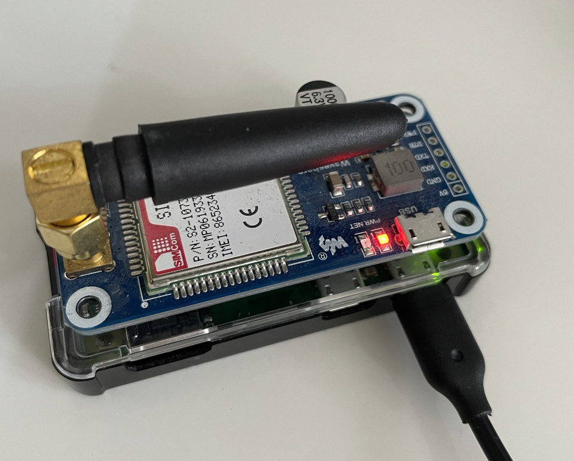
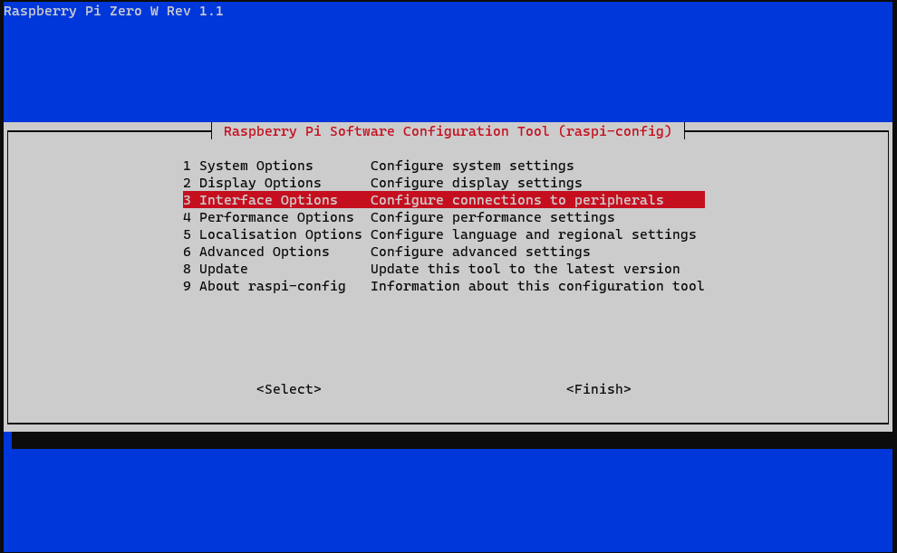
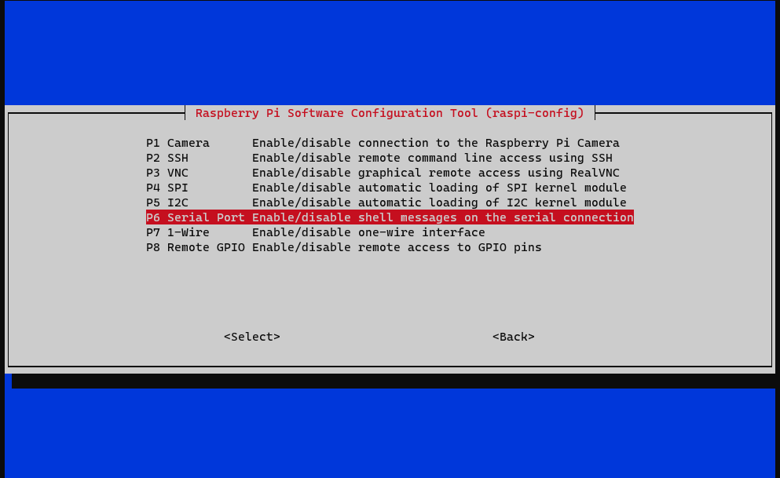

In this guide, I will explain how to receive SMS messages and forward them to your Telegram account using Raspberry PI Zero W and [Wireshare GSM hat](https://www.waveshare.com/SIM7000E-NB-IoT-HAT.htm).



Python will be used to read SMS messages and forward them to [Telegram Bot API](https://core.telegram.org/bots/api). Messages will be listened to by [Gammu](https://wammu.eu/smsd/) SMS service and it will trigger the Python script when an SMS message received.

<!--more-->

## Setup

First of all, we have to enable communication between GSM hat and Raspberry PI Zero, run Raspberry Pi Software Configuration Tool (raspi-config);

```
$ sudo raspi-config
```

Then, follow following actions;

<figure>



<figcaption>

Go to Interface Options

</figcaption>

</figure>

<figure>



<figcaption>

Select and enter P6 Serial Port

</figcaption>

</figure>

<figure>


<figcaption>

Select No at this screen.

</figcaption>

</figure>

<figure>


<figcaption>

Lastly, select Yes at this screen.

</figcaption>

</figure>

Exit configuration tool. Now we need to enable UART on raspberry pi. Shutdown and eject SD card to open in another computer. Open /boot/config.txt file, find the below statement and uncomment it to enable the UART. You can directly append it at the end of the file as well.

```
enable_uart=1
```

Now, reboot raspberry pi device and open the console to install Gammu SMS Deamon and Python PiP package installer.

```
$ sudo apt-get update
$ sudo apt-get install python-pip gammu-smsd
```

Install Telegram Bot API python library.

```
$ sudo pip install python-telegram-bot==12.3.0
```

_Note: Version 12.3.0 is the latest version that is compatible with Python 2.7, if you want to use it with Python 3+ version, you can install the latest available version._

Now you need to create a bot in Telegram and obtain a token. Afterwards, start a chat with that bot in your Telegram account and send a test message to your bot. This will help us to identify your chat ID.

Open following URL with you Telegram Bot token and copy the chat ID in the response;

```
https://api.telegram.org/bot[YOUR-BOT-TOKEN]/getUpdates
```

<figure>


<figcaption>

This is your chat ID.

</figcaption>

</figure>

Save following script in /home/pi/forward-telegram.py;

```
#!/usr/bin/env python
from __future__ import print_function
import os
import sys
import telegram

numparts = int(os.environ['DECODED_PARTS'])

text = ''
# Are there any decoded parts?
if numparts == 0:
    text = os.environ['SMS_1_TEXT']
# Get all text parts
else:
    for i in range(1, numparts + 1):
        varname = 'DECODED_%d_TEXT' % i
        if varname in os.environ:
            text = text + os.environ[varname]

# Log
print('Number %s have sent text: %s' % (os.environ['SMS_1_NUMBER'], text))

#Send by Telegram
bot = telegram.Bot(token='[YOUR-BOT-TOKEN]')
bot.send_message(chat_id=[YOUR CHAT ID], text=os.environ['SMS_1_NUMBER'].strip() + " | "+ text)
```

Make python file executable

```
$ chmod +x /home/pi/forward-telegram.py
```

Update Gammu SMS Deamon's configuration to use GSM hat. Waveshare uses /dev/ttyS0 for communication.

```
$ sudo nano /etc/gammu-smsdrc
```

Find following lines in the configuration file and update with correct values, for me these values are following;

```
port = /dev/ttyS0
connection = at115200
```

Also, we need to specify the script path to be ran by Gammu so add following line below \[smsd\] section;

```
RunOnReceive = /home/pi/forward-telegram.py
```

You can find my complete configuration file [here](https://gist.github.com/mtrcn/045d7eeef1e38c092939d5ee87f96fb0).

Restart Gammu SMS service.

```
$ sudo systemctl restart gammu-smsd.service
```

That's all! You should now able to get your SMS messages to your Telegram account.

You can monitor Gammu SMS service for any problem with the following command;

```
$ sudo systemctl status gammu-smsd.service
```
