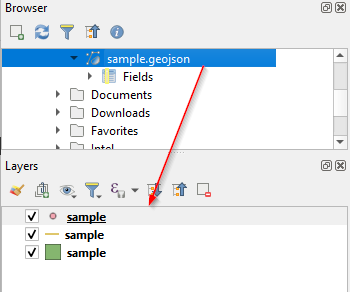
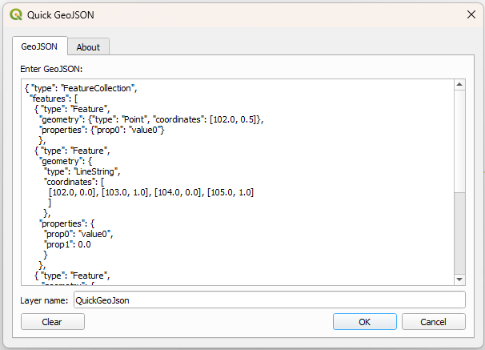

When you need to import a GeoJSON file into your QGIS project, you just need to drag & drop the GeoJSON file from File Browser.

<figure>

<figcaption>

Adding a GeoJSON file as a layer is easy as drag & drop action

</figcaption>

</figure>

However, if the GeoJSON content you want to import is not in a file already, then you need to first create a file with this content and import it as shown above. This workaround could be time-consuming especially if you just want to visualize the GeoJSON to see where geometries are located on the map together with other layers repetitively.

On the other hand, you may ask why not just use [geojson.io](https://geojson.io) for this purpose. It is a valid question if your data is in WGS-84 (EPSG:4326) or Web Mercator (EPSG:3857) coordinate systems and you don't want to see your data along with other layers, but if you need to visualize GeoJSON content in different coordinate systems with other layers, you had to follow the solution above until now.

<!--more-->

During the holiday season, I developed a simple but effective plugin for this problem. Basically, you just need to paste your GeoJSON content into the input area, and that's it. It doesn't matter which coordinate system is in or contains different types of geometries. It recognizes different geometry types and creates layers for each type together with properties.

<figure>

<figcaption>

A screenshot from my Quick GeoJSON plugin

</figcaption>

</figure>

I don't want to take your time, you can either search "Quick GeoJSON" in the plugin browser in QGIS or [click here](https://plugins.qgis.org/plugins/quick-geojson/) to see and install via the QGIS website.
