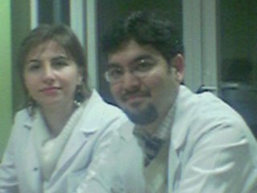

Oturanlar: (Soldan) Çiğdem(Geo.) - Utkum(Geo.) - Betül(Bio.) Ayaktaki: Arzu(Rehberlik) Bukadar çalışmalarına rağmen hâla gülebiliyolar :D

Soldan: Arzu(Rehberlik) - Vildan(Bio.) Ah be Vildan hocam bana attığınız tebeşir size geri sekmişti :D

Soldan: Semanur(Kimya) - Semih(Tükçe) İkiside dersime girer ve derslerinden çok keyif alırım. Hele Semih hocanın o artistik tebeşir tutuşu yok mu!
